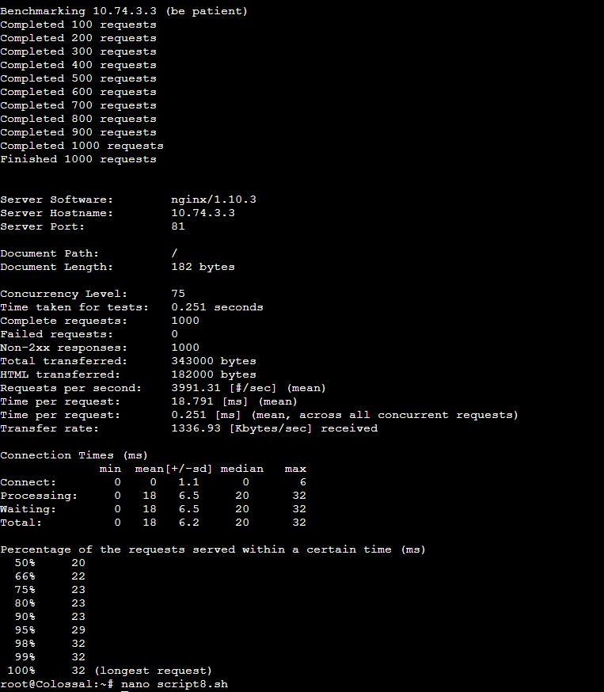
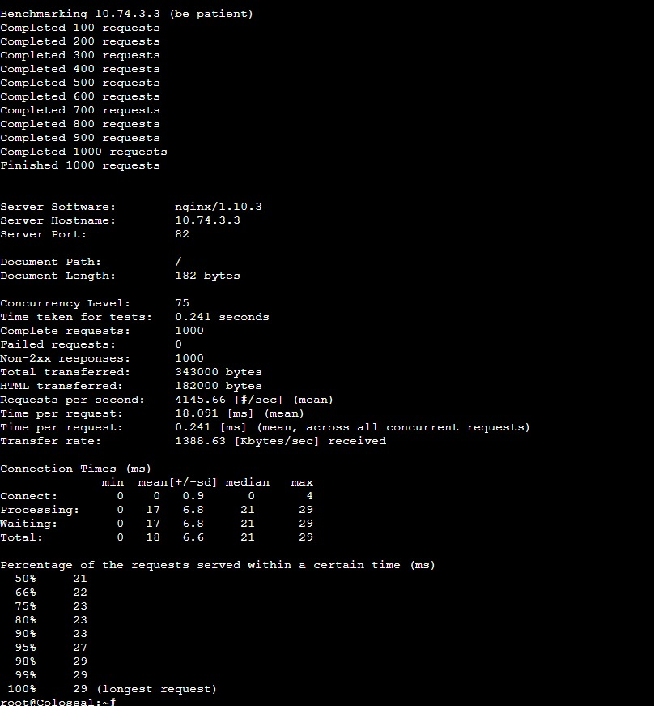
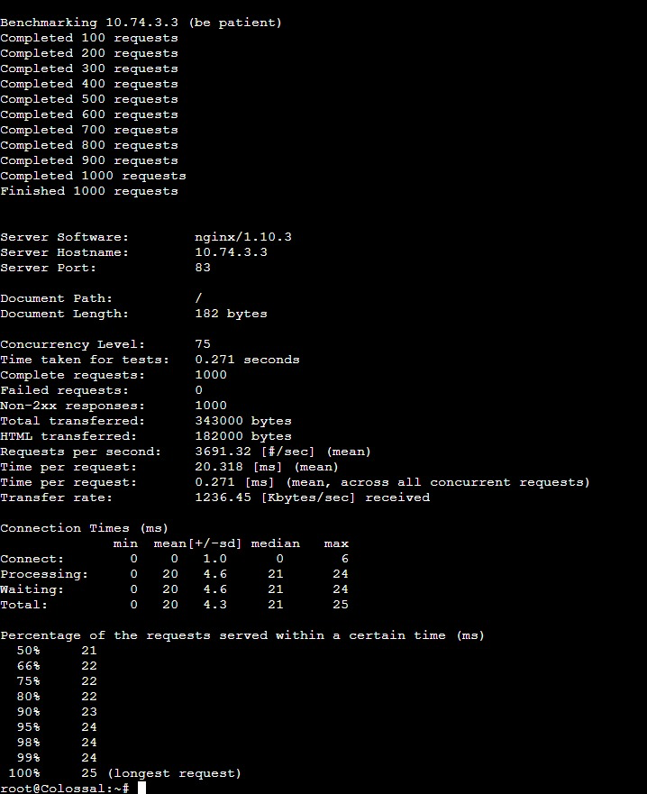
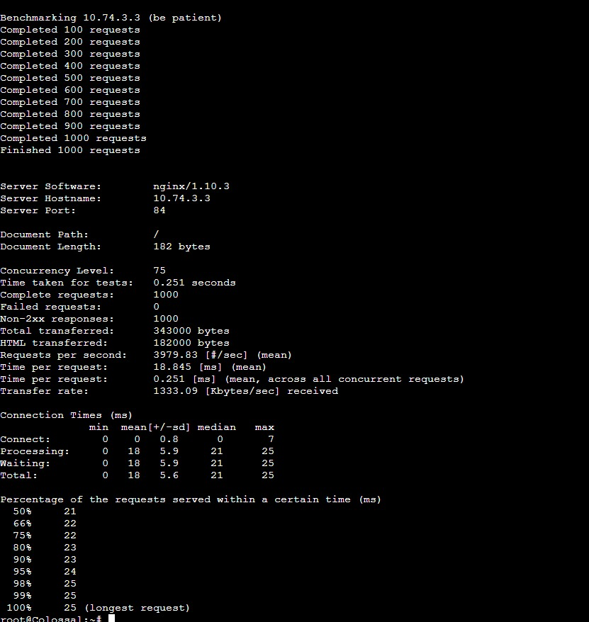
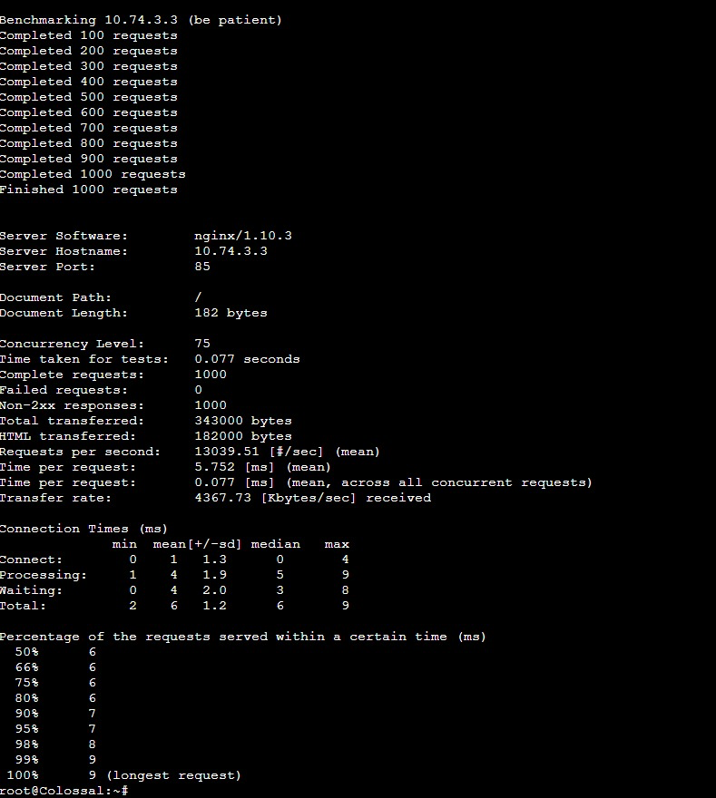
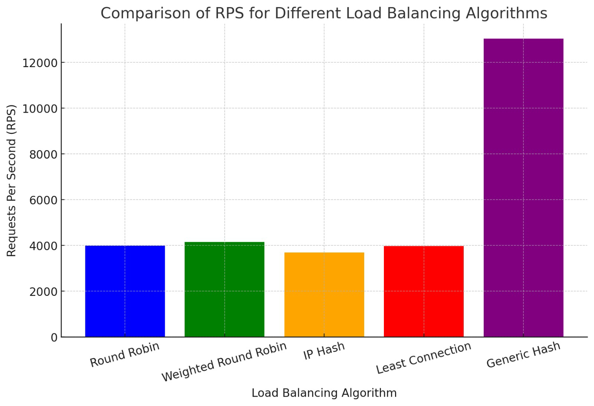
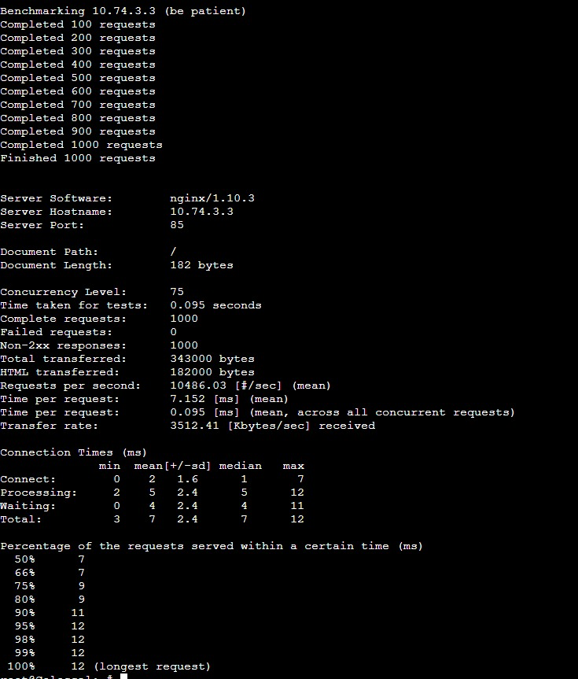
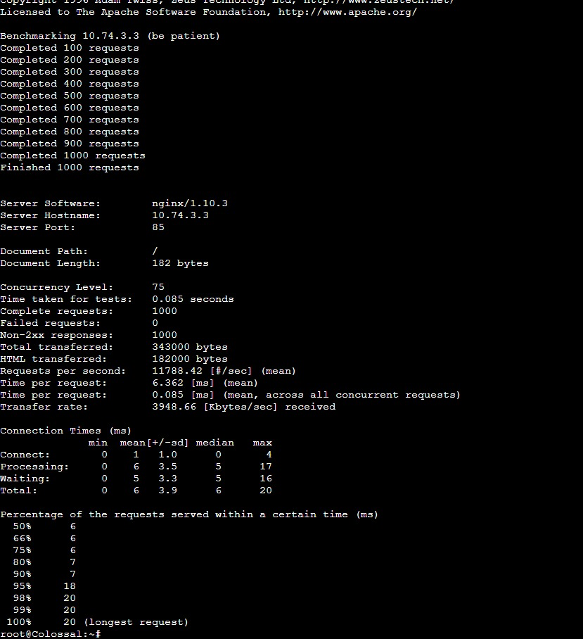
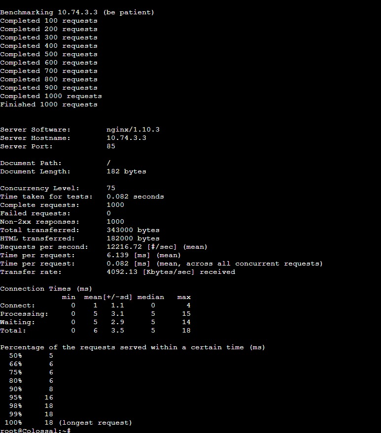
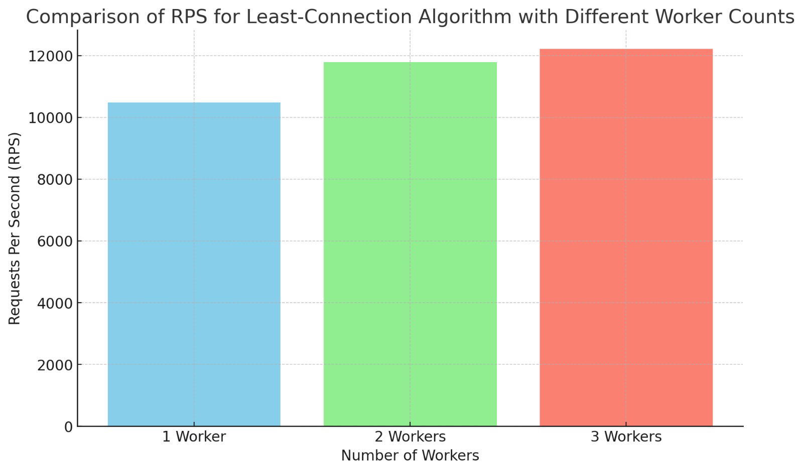

# Analisis (No 8/9)

## Daftar Isi

- [Analisis (No 8/9)](#analisis-no-89)
  - [Daftar Isi](#daftar-isi)
- [No 8](#no-8)
  - [Hasil Analisis](#hasil-analisis)
    - [Round Robin](#round-robin)
    - [Weighted Round Robin](#weighted-round-robin)
    - [IP Hash](#ip-hash)
    - [Least Connection](#least-connection)
    - [Generic Hash](#generic-hash)
  - [Grafik \& Analisis](#grafik--analisis)
- [Analisis - No 9](#analisis---no-9)
  - [Hasil Analisis](#hasil-analisis-1)
    - [1 Worker](#1-worker)
    - [2 Worker](#2-worker)
    - [3 Worker](#3-worker)
  - [Grafik \& Analisis](#grafik--analisis-1)

# No 8

## Hasil Analisis

### Round Robin

### Weighted Round Robin

### IP Hash

### Least Connection

### Generic Hash

## Grafik & Analisis

Generic Hash unggul dalam jumlah permintaan per detik, tetapi pemilihan algoritma terbaik tergantung pada kebutuhan spesifik aplikasi, seperti distribusi beban yang merata, kapasitas server, atau persyaratan konsistensi klien.

# Analisis - No 9

## Hasil Analisis

### 1 Worker

### 2 Worker

### 3 Worker

## Grafik & Analisis

Peningkatan jumlah worker pada algoritma Least-Connection meningkatkan kapasitas penanganan permintaan dan efisiensi, meskipun keuntungan marginal berkurang setelah dua worker.