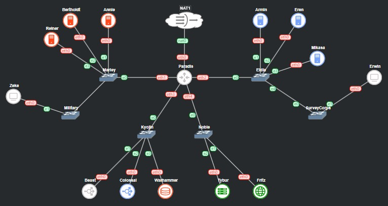
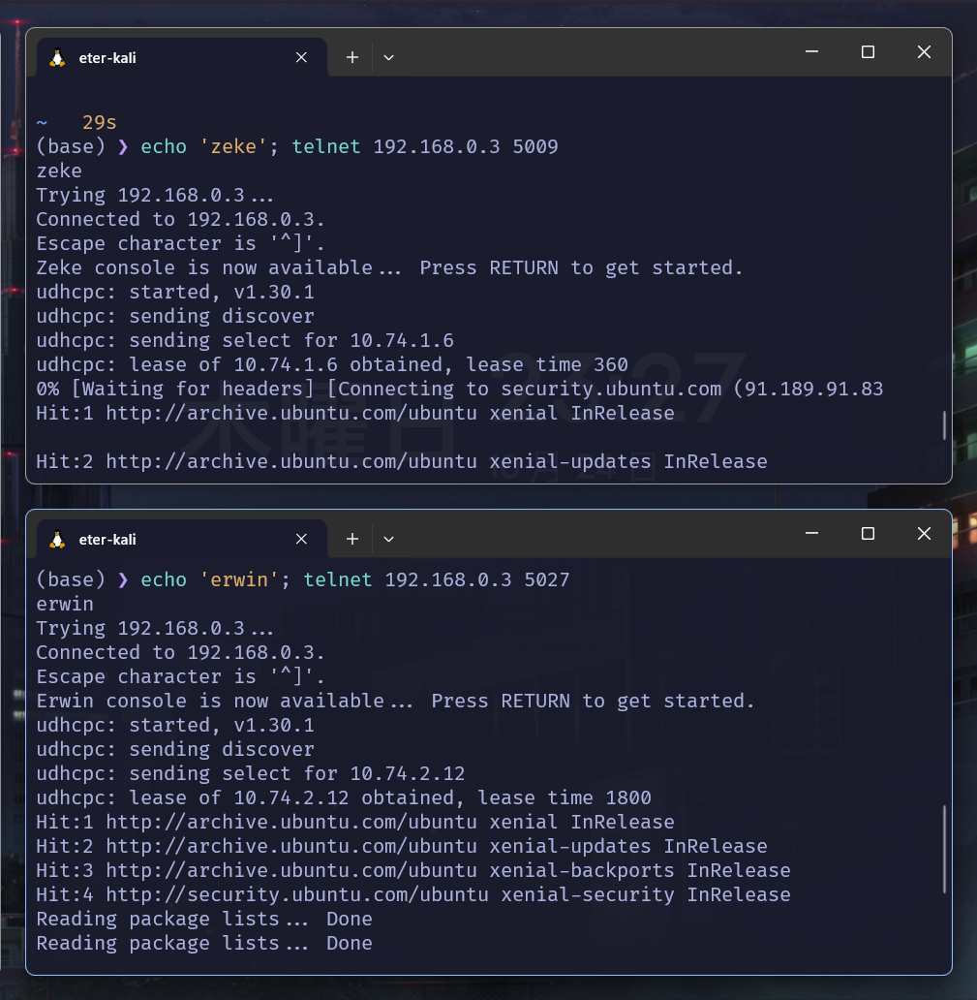
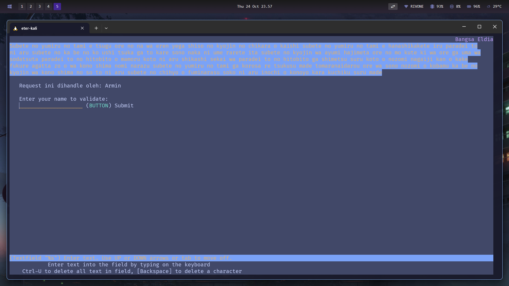

# Jarkom-Modul-3-IT21-2024

|Nama  | NRP |
|--|--|
| Nathan Kho Pancras | 5027231002 |
| Muhammad Andrean Rizq Prasetio | 5027231052 |

**Deskripsi** - Pulau Paradis dan Marley, sama-sama menghadapi ancaman besar dari satu sama lain. Keduanya membangun infrastruktur pertahanan yang kuat untuk melindungi sistem vital mereka. Dengan strategi yang matang, mereka bersiap menghadapi serangan dan mempertahankan wilayah masing-masing.

## Daftar Isi

- [Jarkom-Modul-3-IT21-2024](#jarkom-modul-3-it21-2024)
  - [Daftar Isi](#daftar-isi)
- [Prerequisites](#prerequisites)
  - [Topologi](#topologi)
  - [Konfigurasi](#konfigurasi)
  - [Set .bashrc](#set-bashrc)
- [Soal](#soal)
  - [No 0](#no-0)
    - [Penyelesaian](#penyelesaian)
  - [No 1](#no-1)
  - [No 2-5](#no-2-5)
    - [Penyelesaian](#penyelesaian-1)
  - [No 6](#no-6)
    - [Penyelesaian](#penyelesaian-2)
  - [No 7](#no-7)
    - [Penyelesaian](#penyelesaian-3)
    - [Request Testing](#request-testing)
  - [No 8](#no-8)
    - [Penyelesaian](#penyelesaian-4)
  - [No 9](#no-9)
    - [Penyelesaian](#penyelesaian-5)
  - [No 10](#no-10)
    - [Penyelesaian](#penyelesaian-6)
  - [No 11](#no-11)
    - [Penyelesaian](#penyelesaian-7)
  - [No 12](#no-12)
    - [Penyelesaian](#penyelesaian-8)
  - [No 13](#no-13)
    - [Penyelesaian](#penyelesaian-9)
    - [Menambahkan User](#menambahkan-user)
    - [Akses dari Worker](#akses-dari-worker)

# Prerequisites

## Topologi



## Konfigurasi

| **Name**      | **Interface** | **Address**   | **Netmask**        | **Gateway**   | **Configuration Type** |
|---------------|---------------|---------------|--------------------|--------------|------------------------|
| **Paradis**   | eth0          | -             | -                  | -            | DHCP                   |
|               | eth1          | 10.74.1.1     | 255.255.255.0      | -            | Static                 |
|               | eth2          | 10.74.2.1     | 255.255.255.0      | -            | Static                 |
|               | eth3          | 10.74.3.1     | 255.255.255.0      | -            | Static                 |
|               | eth4          | 10.74.4.1     | 255.255.255.0      | -            | Static                 |
| **Annie**     | eth0          | 10.74.1.2     | 255.255.255.0      | 10.74.1.1    | Static                 |
| **Berthold**  | eth0          | 10.74.1.3     | 255.255.255.0      | 10.74.1.1    | Static                 |
| **Reiner**    | eth0          | 10.74.1.4     | 255.255.255.0      | 10.74.1.1    | Static                 |
| **Armin**     | eth0          | 10.74.2.2     | 255.255.255.0      | 10.74.2.1    | Static                 |
| **Eren**      | eth0          | 10.74.2.3     | 255.255.255.0      | 10.74.2.1    | Static                 |
| **Mikasa**    | eth0          | 10.74.2.4     | 255.255.255.0      | 10.74.2.1    | Static                 |
| **Beast**     | eth0          | 10.74.3.2     | 255.255.255.0      | 10.74.3.1    | Static                 |
| **Colossal**  | eth0          | 10.74.3.3     | 255.255.255.0      | 10.74.3.1    | Static                 |
| **Warhammer** | eth0          | 10.74.3.4     | 255.255.255.0      | 10.74.3.1    | Static                 |
| **Fritz**     | eth0          | 10.74.4.2     | 255.255.255.0      | 10.74.4.1    | Static                 |
| **Tybur**     | eth0          | 10.74.4.3     | 255.255.255.0      | 10.74.4.1    | Static                 |
| **Zeke & Erwin** | eth0       | -             | -                  | -            | DHCP                   |

**Paradis (Router & DHCP Relay)**
```
# DHCP config for eth0
auto eth0
iface eth0 inet dhcp

auto eth1
iface eth1 inet static
	address 10.74.1.1
	netmask 255.255.255.0

auto eth2
iface eth2 inet static
	address 10.74.2.1
	netmask 255.255.255.0

auto eth3
iface eth3 inet static
	address 10.74.3.1
	netmask 255.255.255.0

auto eth4
iface eth4 inet static
	address 10.74.4.1
	netmask 255.255.255.0
```

**Annie (Laravel Worker)**
```
auto eth0
iface eth0 inet static
	address 10.74.1.2
	netmask 255.255.255.0
	gateway 10.74.1.1
```

**Berthold (Laravel Worker)**
```
auto eth0
iface eth0 inet static
	address 10.74.1.3
	netmask 255.255.255.0
	gateway 10.74.1.1
```

**Reiner (Laravel Worker)**
```
auto eth0
iface eth0 inet static
	address 10.74.1.4
	netmask 255.255.255.0
	gateway 10.74.1.1
```

**Armin (PHP Worker)**
```
auto eth0
iface eth0 inet static
	address 10.74.2.2
	netmask 255.255.255.0
	gateway 10.74.2.1
```

**Eren (PHP Worker)**
```
auto eth0
iface eth0 inet static
	address 10.74.2.3
	netmask 255.255.255.0
	gateway 10.74.2.1
```

**Mikasa (PHP Worker)**
```
auto eth0
iface eth0 inet static
	address 10.74.2.4
	netmask 255.255.255.0
	gateway 10.74.2.1
```

**Beast (Laravel LB)**
```
auto eth0
iface eth0 inet static
	address 10.74.3.2
	netmask 255.255.255.0
	gateway 10.74.3.1
```

**Colossal (PHP LB)**
```
auto eth0
iface eth0 inet static
	address 10.74.3.3
	netmask 255.255.255.0
	gateway 10.74.3.1
```

**Warhammer (Database)**
```
auto eth0
iface eth0 inet static
	address 10.74.3.4
	netmask 255.255.255.0
	gateway 10.74.3.1
```

**Fritz (DNS Server)**

```
auto eth0
iface eth0 inet static
	address 10.74.4.2
	netmask 255.255.255.0
	gateway 10.74.4.1
```

**Tybur (DHCP Server)**

```
auto eth0
iface eth0 inet static
	address 10.74.4.3
	netmask 255.255.255.0
	gateway 10.74.4.1
```

**Zeke & Erwin (Client)**
```
auto eth0
iface eth0 inet dhcp
```

## Set .bashrc

**Paradis (DHCP Relay)**
```
iptables -t nat -A POSTROUTING -o eth0 -j MASQUERADE -s 10.74.0.0/16
apt-get update
apt-get install isc-dhcp-relay -y
service isc-dhcp-relay start
```

**Tybur (DHCP Server)**
```
echo 'nameserver 10.74.4.2' > /etc/resolv.conf
apt-get update
apt-get install isc-dhcp-server -y
service isc-dhcp-server restart
service isc-dhcp-server status
```

**Fritz (DNS Server)**
```
echo 'nameserver 192.168.122.1' > /etc/resolv.conf
apt-get update
apt-get install bind9 -y
```

**Warhammer (Database Server)**
```
echo 'nameserver 10.74.4.2' > /etc/resolv.conf
apt-get update
apt-get install mariadb-server -y
```

**Beast & Colossal (Load Balancer)**
```
echo 'nameserver 10.74.4.2' > /etc/resolv.conf
apt-get update
apt-get install bind9 apache2-utils nginx -y

service nginx start
```

**Annie, Bertholdt, Reiner (Laravel Worker)**
``` 
echo 'nameserver 192.245.4.2' > /etc/resolv.conf
apt-get update
apt-get install mariadb-client -y
```

**Armin, Eren, Mikasa (PHP Worker)**
```
echo 'nameserver 10.74.4.2' > /etc/resolv.conf
apt-get update
apt-get install lynx curl unzip nginx software-properties-common php7.3 php7.3-fpm -y
```

**Zeke & Erwin (Client)**
```
apt-get update
apt-get install lynx htop apache2-utils jq -y
```

# Soal

## No 0

Pulau Paradis dan Marley, sama-sama menghadapi ancaman besar dari satu sama lain. Keduanya membangun infrastruktur pertahanan yang kuat untuk melindungi sistem vital mereka. Dengan strategi yang matang, mereka bersiap menghadapi serangan dan mempertahankan wilayah masing-masing.
Bangsa Marley, dipimpin oleh Zeke, telah mempersiapkan Annie, Bertholdt, dan Reiner untuk menyerang menggunakan Laravel Worker. Di sisi lain, Klan Eldia dari Paradis telah mempersiapkan Armin, Eren, dan Mikasa sebagai PHP Worker untuk mempertahankan pulau tersebut. Warhammer bertindak sebagai Database Server, sementara Beast dan Colossal sebagai Load Balancer. 

Pulau Paradis telah menjadi tempat yang damai selama 1000 tahun, namun kedamaian tersebut tidak bertahan selamanya. Perang antara kaum Marley dan Eldia telah mencapai puncak. Kaum Marley yang dipimpin oleh Zeke, me-register domain name marley.yyy.com untuk worker Laravel mengarah pada Annie. Namun ternyata tidak hanya kaum Marley saja yang berinisiasi, kaum Eldia ternyata sudah mendaftarkan domain name eldia.yyy.com untuk worker PHP (0) mengarah pada Armin.

### Penyelesaian

**Script DNS Server - dnsserv.sh (Fritz)**

```bash
echo 'zone "marley.it21.com" { 
        type master; 
        file "/etc/bind/sites/marley.it21.com";
};

zone "eldia.it21.com" {
        type master;
        file "/etc/bind/sites/eldia.it21.com";
}; ' > /etc/bind/named.conf.local

mkdir -p /etc/bind/sites
cp /etc/bind/db.local /etc/bind/sites/marley.it21.com
cp /etc/bind/db.local /etc/bind/sites/eldia.it21.com

echo ';
; BIND data file for local loopback interface
;
$TTL    604800
@       IN      SOA     marley.it21.com. root.marley.it21.com. (
                              2         ; Serial
                         604800         ; Refresh
                          86400         ; Retry
                        2419200         ; Expire
                         604800 )       ; Negative Cache TTL
;
@       IN      NS      marley.it21.com.
@       IN      A       10.74.1.2     ; IP Annie
www     IN      CNAME   marley.it21.com.' > /etc/bind/sites/marley.it21.com

echo ';
; BIND data file for local loopback interface
;
$TTL    604800
@       IN      SOA     eldia.it21.com. root.eldia.it21.com. (
                              2         ; Serial
                         604800         ; Refresh
                          86400         ; Retry
                        2419200         ; Expire
                         604800 )       ; Negative Cache TTL
;
@       IN      NS      eldia.it21.com.
@       IN      A       10.74.2.2     ; IP Armin
www     IN      CNAME   eldia.it21.com.' > /etc/bind/sites/eldia.it21.com

echo 'options {
        directory "/var/cache/bind";

        forwarders {
                192.168.122.1;
        };

        // dnssec-validation auto;
        allow-query{any;};
        auth-nxdomain no;
        listen-on-v6 { any; };
}; ' > /etc/bind/named.conf.options

service bind9 restart
```

## No 1

Lakukan konfigurasi sesuai dengan peta yang sudah diberikan. (1)

- [Topologi](#topologi)
- [Konfigurasi](#konfigurasi)
- [Set .bashrc](#set-bashrc)

## No 2-5

Jauh sebelum perang dimulai, ternyata para keluarga bangsawan, Tybur dan Fritz, telah membuat kesepakatan sebagai berikut:
1. Semua Client harus menggunakan konfigurasi ip address dari keluarga Tybur (dhcp). 
2. Client yang melalui bangsa marley mendapatkan range IP dari [prefix IP].1.05 - [prefix IP].1.25 dan [prefix IP].1.50 - [prefix IP].1.100 (2)
3. Client yang melalui bangsa eldia **mendapatkan** range IP dari [prefix IP].2.09 - [prefix IP].2.27 dan [prefix IP].2 .81 - [prefix IP].2.243 (3)
4. Client mendapatkan DNS dari keluarga Fritz dan dapat terhubung dengan internet melalui DNS tersebut (4)
5. Dikarenakan keluarga Tybur tidak menyukai kaum eldia, maka mereka hanya meminjamkan ip address ke kaum eldia selama 6 menit. Namun untuk kaum marley, keluarga Tybur meminjamkan ip address selama 30 menit. Waktu maksimal dialokasikan untuk peminjaman alamat IP selama 87 menit. (5)

Seiring berjalannya waktu kondisi semakin memanas, untuk bersiap perang. Kaum Eldia melakukan deployment sebagai berikut
|Image |
|--|
|danielcristh0/debian-buster:1.1|

### Penyelesaian

**Script DHCP Server - dhcpserv.sh (Tybur)**

```bash
echo '
INTERFACESv4="eth0"
INTERFACESv6=""
' > /etc/default/isc-dhcp-server

echo '
subnet 10.74.1.0 netmask 255.255.255.0 {
	range 10.74.1.5 10.74.1.25;
	range 10.74.1.50 10.74.1.100;
	option routers 10.74.1.1;
	option broadcast-address 10.74.1.255;
	option domain-name-servers 10.74.4.2;
	default-lease-time 360;
	max-lease-time 5220;
}

subnet 10.74.2.0 netmask 255.255.255.0 {
	range 10.74.2.9 10.74.2.27;
	range 10.74.2.81 10.74.2.243;
	option routers 10.74.2.1;
	option broadcast-address 10.74.1.255;
	option domain-name-servers 10.74.4.2;
	default-lease-time 1800;
	max-lease-time 5220;
}

subnet 10.74.3.0 netmask 255.255.255.0 {
	option routers 10.74.3.1;
}

subnet 10.74.4.0 netmask 255.255.255.0 {
	option routers 10.74.4.1;
}
' > /etc/dhcp/dhcpd.conf

service isc-dhcp-server restart
```

**Script DHCP Relay - dhcprelay.sh (Paradis)**

```bash
echo '
SERVERS="10.74.4.3"
INTERFACES="eth1 eth2 eth3 eth4"
OPTIONS=""
' > /etc/default/isc-dhcp-relay

echo '
net.ipv4.ip_forward=1
' > /etc/sysctl.conf

service isc-dhcp-relay restart
```



## No 6

1. Armin berinisiasi untuk memerintahkan setiap worker PHP untuk melakukan konfigurasi virtual host untuk website berikut https://intip.in/BangsaEldia dengan menggunakan php 7.3 (6)

### Penyelesaian

**Script PHP Worker - phpworker.sh (Armin, Eren, Mikasa)**

```bash
service nginx start
service php7.3-fpm start

mkdir -p /var/www/eldia.it21.com

curl -L -o bangsaEldia.zip 'https://drive.google.com/uc?export=download&id=1TvebIeMQjRjFURKVtA32lO9aL7U2msd6' -k
unzip -o bangsaEldia.zip -d /var/www/eldia.it21.com

cp /etc/nginx/sites-available/default /etc/nginx/sites-available/eldia.it21.com
ln -s /etc/nginx/sites-available/eldia.it21.com /etc/nginx/sites-enabled/
rm /etc/nginx/sites-enabled/default

echo '
server {
  listen 80;
  listen [::]:80;

  root /var/www/eldia.it21.com;
  index index.php index.html index.htm;

  server_name eldia.it21.com;

  location / {
    try_files $uri $uri/ =404;
  }

  location ~ \.php$ {
    include snippets/fastcgi-php.conf;
    fastcgi_pass unix:/var/run/php/php7.3-fpm.sock;
  }

  location ~ /\.ht {
    deny all;
  }
}' > /etc/nginx/sites-available/eldia.it21.com

service nginx restart
```



## No 7

2. Dikarenakan Armin sudah mendapatkan kekuatan titan colossal, maka bantulah kaum eldia menggunakan colossal agar dapat bekerja sama dengan baik. Kemudian lakukan testing dengan 6000 request dan 200 request/second. (7)

### Penyelesaian

**Script PHP LB - phplb.sh (Colossal)**

```bash
cp /etc/nginx/sites-available/default /etc/nginx/sites-available/lb_php

echo 'upstream worker {

    #least_conn;
    #ip_hash;

    server 10.74.2.2;
    server 10.74.2.3;
    server 10.74.2.4;
}

server {
    listen 80;
    server_name eldia.it21.com www.eldia.it21.com;

    root /var/www/html;

    index index.html index.htm index.nginx-debian.html index.php;

    server_name _;

    location / {
        proxy_pass http://worker;
    }
} ' > /etc/nginx/sites-available/lb_php

ln -s /etc/nginx/sites-available/lb_php /etc/nginx/sites-enabled/
rm /etc/nginx/sites-enabled/default

service nginx restart
```

**Script DNS Server - dnsserv.sh (Fritz)**

```bash
echo 'zone "marley.it21.com" { 
        type master; 
        file "/etc/bind/sites/marley.it21.com";
};

zone "eldia.it21.com" {
        type master;
        file "/etc/bind/sites/eldia.it21.com";
}; ' > /etc/bind/named.conf.local

mkdir -p /etc/bind/sites
cp /etc/bind/db.local /etc/bind/sites/marley.it21.com
cp /etc/bind/db.local /etc/bind/sites/eldia.it21.com

echo ';
; BIND data file for local loopback interface
;
$TTL    604800
@       IN      SOA     marley.it21.com. root.marley.it21.com. (
                              2         ; Serial
                         604800         ; Refresh
                          86400         ; Retry
                        2419200         ; Expire
                         604800 )       ; Negative Cache TTL
;
@       IN      NS      marley.it21.com.
@       IN      A       10.74.1.2     ; IP Annie
www     IN      CNAME   marley.it21.com.' > /etc/bind/sites/marley.it21.com

echo ';
; BIND data file for local loopback interface
;
$TTL    604800
@       IN      SOA     eldia.it21.com. root.eldia.it21.com. (
                              2         ; Serial
                         604800         ; Refresh
                          86400         ; Retry
                        2419200         ; Expire
                         604800 )       ; Negative Cache TTL
;
@       IN      NS      eldia.it21.com.
@       IN      A       10.74.3.3     ; IP Colossal
www     IN      CNAME   eldia.it21.com.' > /etc/bind/sites/eldia.it21.com

echo 'options {
        directory "/var/cache/bind";

        forwarders {
                192.168.122.1;
        };

        // dnssec-validation auto;
        allow-query{any;};
        auth-nxdomain no;
        listen-on-v6 { any; };
}; ' > /etc/bind/named.conf.options

service bind9 restart
```

### Request Testing

## No 8

3. Karena Erwin meminta “laporan kerja Armin”, maka dari itu buatlah analisis hasil testing dengan 1000 request dan 75 request/second untuk masing-masing algoritma Load Balancer dengan ketentuan sebagai berikut:
- Nama Algoritma Load Balancer
- Report hasil testing pada Apache Benchmark
- Grafik request per second untuk masing masing algoritma. 
- Analisis (8)

PS:
“laporan kerja Armin” dikumpulkan dalam bentuk PDF dengan format: yyy_LaporanArmin.pdf
yyy merupakan kode kelompok

### Penyelesaian

```bash
```

## No 9

4. Dengan menggunakan algoritma Least-Connection, lakukan testing dengan menggunakan 3 worker, 2 worker, dan 1 worker sebanyak 1000 request dengan 10 request/second, kemudian tambahkan grafiknya pada “laporan kerja Armin”. (9)

### Penyelesaian

```bash
```

## No 10

5. Selanjutnya coba tambahkan keamanan dengan konfigurasi autentikasi di Colossal dengan dengan kombinasi username: “arminannie” dan password: “jrkmyyy”, dengan yyy merupakan kode kelompok. Terakhir simpan file “htpasswd” nya di /etc/nginx/supersecret/ (10)

### Penyelesaian

**Script PHP LB - phplb.sh (Colossal)**

```bash
mkdir -p /etc/nginx/supersecret
htpasswd -b -c /etc/nginx/supersecret/htpasswd arminannie jrkmit21

cp /etc/nginx/sites-available/default /etc/nginx/sites-available/lb_php

echo 'upstream worker {

    #least_conn;
    #ip_hash;

    server 10.74.2.2;
    server 10.74.2.3;
    server 10.74.2.4;
}

server {
    listen 80;
    server_name eldia.it21.com www.eldia.it21.com;

    root /var/www/html;

    index index.html index.htm index.nginx-debian.html index.php;

    server_name _;

    location / {
        proxy_pass http://worker;
    }

	auth_basic "Restricted Content";
    auth_basic_user_file /etc/nginx/supersecret/htpasswd;
} ' > /etc/nginx/sites-available/lb_php

ln -s /etc/nginx/sites-available/lb_php /etc/nginx/sites-enabled/
rm /etc/nginx/sites-enabled/default

service nginx restart
```

## No 11

6. Lalu buat untuk setiap request yang mengandung /titan akan di proxy passing menuju halaman https://attackontitan.fandom.com/wiki/Attack_on_Titan_Wiki (11) 
hint: (proxy_pass)

### Penyelesaian

**Script PHP LB - phplb.sh (Colossal)**

```bash
mkdir -p /etc/nginx/supersecret
htpasswd -b -c /etc/nginx/supersecret/htpasswd arminannie jrkmit21

cp /etc/nginx/sites-available/default /etc/nginx/sites-available/lb_php

echo 'upstream worker {

    #least_conn;
    #ip_hash;

    server 10.74.2.2;
    server 10.74.2.3;
    server 10.74.2.4;
}

server {
    listen 80;
    server_name eldia.it21.com www.eldia.it21.com;

    root /var/www/html;

    index index.html index.htm index.nginx-debian.html index.php;

    server_name _;

    location / {
        proxy_pass http://worker;
    }

	location /titan {
        proxy_pass http://attackontitan.fandom.com;
        proxy_set_header Host attackontitan.fandom.com;
        proxy_set_header X-Real-IP $remote_addr;
        proxy_set_header X-Forwarded-For $proxy_add_x_forwarded_for;
        proxy_set_header X-Forwarded-Proto $scheme;
    }
	
	auth_basic "Restricted Content";
    auth_basic_user_file /etc/nginx/supersecret/htpasswd;
} ' > /etc/nginx/sites-available/lb_php

ln -s /etc/nginx/sites-available/lb_php /etc/nginx/sites-enabled/
rm /etc/nginx/sites-enabled/default

service nginx restart
```

## No 12

7. Selanjutnya Colossal ini hanya boleh diakse s oleh client dengan IP [Prefix IP].1.77, [Prefix IP].1.88, [Prefix IP].2.144, dan [Prefix IP].2.156. (12) 
hint: (fixed in dulu clientnya)

### Penyelesaian

**Script PHP LB - phplb.sh (Colossal)**

```bash
mkdir -p /etc/nginx/supersecret
htpasswd -b -c /etc/nginx/supersecret/htpasswd arminannie jrkmit21

cp /etc/nginx/sites-available/default /etc/nginx/sites-available/lb_php

echo 'upstream worker {

    #least_conn;
    #ip_hash;

    server 10.74.2.2;
    server 10.74.2.3;
    server 10.74.2.4;
}

server {
    listen 80;
    server_name eldia.it21.com www.eldia.it21.com;

    root /var/www/html;

    index index.html index.htm index.nginx-debian.html index.php;

    server_name _;

    location / {
		allow 10.74.1.77;
        allow 10.74.1.88;
        allow 10.74.2.144;
        allow 10.74.2.156;
        deny all;
        proxy_pass http://worker;
    }

	location /titan {
        proxy_pass http://attackontitan.fandom.com;
        proxy_set_header Host attackontitan.fandom.com;
        proxy_set_header X-Real-IP $remote_addr;
        proxy_set_header X-Forwarded-For $proxy_add_x_forwarded_for;
        proxy_set_header X-Forwarded-Proto $scheme;
    }
	
	auth_basic "Restricted Content";
    auth_basic_user_file /etc/nginx/supersecret/htpasswd;
} ' > /etc/nginx/sites-available/lb_php

ln -s /etc/nginx/sites-available/lb_php /etc/nginx/sites-enabled/
rm /etc/nginx/sites-enabled/default

service nginx restart
```

**Script DHCP Server - dhcpserv.sh (Tybur)**

Dilakukan agar IP Client fixed melalui MAC address. Untuk melakukan testing skenario akses melalui Client yang IPnya tidak di whitelist maka step ini bisa dihilangkan.

```bash
host Zeke {
    hardware ethernet 5a:41:9c:fe:54:9a;
    fixed-address 10.74.1.77;
}

host Erwin {
    hardware ethernet 1e:d2:13:56:20:b4;
    fixed-address 10.74.2.156;
}
```

## No 13

Melihat perlawanan yang sengit dari kaum eldia, kaum marley pun memutar otak dan mengatur para worker di marley.
1. Karena mengetahui bahwa ada keturunan marley yang mewarisi kekuatan titan, Zeke pun berinisiatif untuk menyimpan data data penting di Warhammer, dan semua data tersebut harus dapat diakses oleh anak buah kesayangannya, Annie, Reiner, dan Berthold. (13)

### Penyelesaian

**Script Database - data.sh (Warhammer)**

```bash
apt-get update
apt-get install mariadb-server -y
service mysql start

echo '# This group is read both by the client and the server
# use it for options that affect everything
[client-server]

# Import all .cnf files from configuration directory
!includedir /etc/mysql/conf.d/
!includedir /etc/mysql/mariadb.conf.d/

# Options affecting the MySQL server (mysqld)
[mysqld]
skip-networking=0
skip-bind-address
' > /etc/mysql/my.cnf 

sed -i 's/127.0.0.1/0.0.0.0/g' /etc/mysql/mariadb.conf.d/50-server.cnf

service mysql restart
```

### Menambahkan User

```
mysql -u root -p
Enter password: (kosong)
```

```mysql
CREATE USER 'it21'@'%' IDENTIFIED BY 'it21';
CREATE USER 'it21'@'localhost' IDENTIFIED BY 'it21';
CREATE DATABASE db_it21;
GRANT ALL PRIVILEGES ON *.* TO 'it21'@'%';
GRANT ALL PRIVILEGES ON *.* TO 'it21'@'localhost';
FLUSH PRIVILEGES;
```

### Akses dari Worker

```
mysql --host=10.74.3.4 --port=3306 --user=it21 --password=it21 db_it21 -e "SHOW DATABASES;"
```